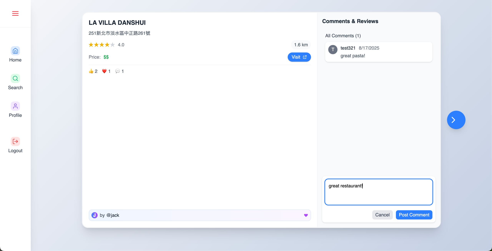

# Eat What Now - Monorepo

This repository contains both the **backend server** and **frontend client** projects for the Eat What Now application.

## Overview

## Project Structure

### Demo Video

Currently, I've taken my site down from AWS hosting because I didn't want to spend anymore on keeping it up as it's just a side project. If you want to see how it works, you can click on the youtube link below for short demo video.

https://youtu.be/gjs5NwR4Cdo

_Click the image below to watch the demo video on YouTube_

[](https://youtu.be/gjs5NwR4Cdo)



- **/server**: Node.js/TypeScript backend API

  - Handles authentication, user management, restaurant data, and API documentation (Swagger).
  - Uses PostgreSQL, Docker Compose, pg-promise, and Zod for validation.
  - See [`server/readme.md`](server/readme.md) for setup, environment variables, and API usage details.

- **/client**: React TypeScript frontend
  - Provides the user interface for authentication, browsing restaurants, and user actions.
  - Built with Vite for fast development and modern tooling.
  - See [`client/README.md`](client/README.md) for setup, available scripts, and usage instructions.

## Getting Started

```bash
nvm use 20
npm install

cp server/.env.example server/.env
cp client/.env.example client/.env

npm run dev
```

This will start both the backend API and frontend app concurrently.

**For more details**

- See [`server/readme.md`](server/readme.md) for backend setup, environment variables, and API documentation.
- See [`client/README.md`](client/README.md) for frontend setup and usage.

---

For any issues or contributions, please refer to the individual project readme files or open an issue in this repository.

## Personal Memo - The Why and How.

"EatWhatNow is a full-stack restaurant discovery platform with a unique twist - instead of overwhelming users with endless lists, it presents restaurants in a card interface."

**The core value proposition is simple**: Turn the stress of choosing where to eat into an engaging, game-like experience that gets you to a decision faster."

### **Frontend Innovation**

"The client is built with **React 19** and **TypeScript**, featuring:

- **Infinite scroll pagination** - new restaurants load seamlessly as you swipe
- **Real-time visual feedback** with LIKE/PASS indicators
- **Location-based recommendations** using the browser's geolocation API
- Built without global state management **by design** - demonstrating clean component architecture and prop drilling alternatives"

### **Backend Architecture**

"The backend showcases enterprise-level practices:

- **Node.js/Express with TypeScript** for type safety and scalability
- **PostgreSQL with PostGIS extension** for geospatial restaurant queries
- **Raw SQL instead of ORM** - I chose this intentionally to deepen my database fundamentals
- **JWT authentication** with secure session management
- **Google Places API integration** for real restaurant data
- **Rate limiting and API key authentication** for security
- **CRON jobs** for automated data aggregation
- **Swagger documentation** for API testing and team collaboration"

### **Deliberate Learning Choices**

"I made several intentional decisions to maximize learning on specific areas:

1. **Raw SQL over ORM** - Wanted to understand database operations at a fundamental level
2. **No global state management** - Proves you can build complex UIs with clean React patterns
3. **Full monorepo setup** - Experience with managing multiple related applications"

### **Problem-Solving Examples**

"Some interesting challenges I solved:

- **Geolocation caching** - Implemented localStorage caching so location loads instantly on reload
- **Infinite scroll optimization** - Prevents duplicate API calls during fast swiping
- **Add Location to DB** - To reduce cost of Google Places API, I implemented features to allow users to contribute to adding restaurants in DB.
- **Basic AWS Setup** - Nginx, EC2, Relational DB
